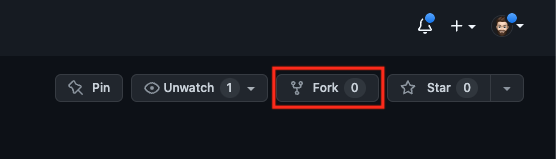
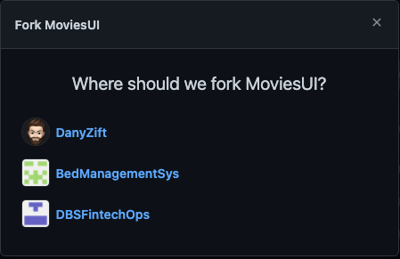
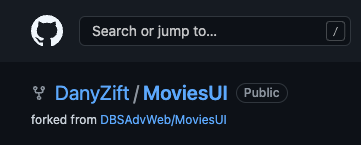
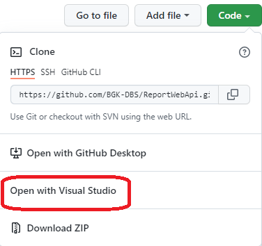
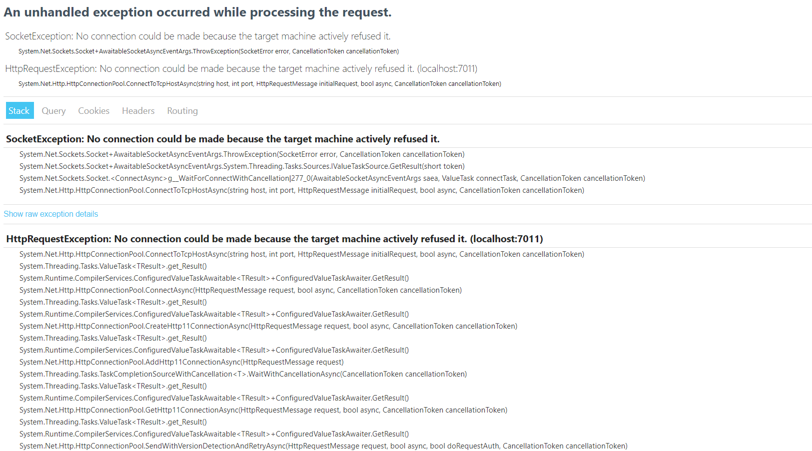
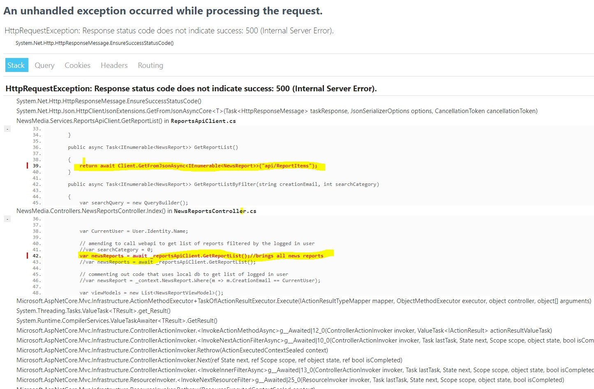

# NewsMedia  - Developer Setup

## Description:

This document is for developers and provides instructions on how to run the NewsMedia application locally. 

This document was created with the help of https://www.markdownguide.org/cheat-sheet

## Requirements 

* .NET version 6
* Visual Studio (Preferred) or Visual Studio Code
* Markdown editor plugin
* Reports API must be running locally - [Reports Web API GitHub Link](https://github.com/BGK-DBS/ReportWebApi)
* Comments API must be running locally - [Reports Web API GitHub Link](https://github.com/BGK-DBS/CommentsWebApi)

## Download the CodeBase

Fork the project to your own Git Account. The fork button is on the top right of the newsMedia  repo:



A popup will appear asking you where you want to fork to - in my view its my personal account - DanyZift. Pick your own as it will be different on your view:



After clicking on your account it should then redirect to the forked repo. You should then see the following in the top right of the screen:(again your account name will show)



An alternative is to Open the solution in visual studio by selecting the Green Code button and then clicking on the "open with Visual Studio"


A box will appear asking can Github open in visual studio- continue by selecting this:


In visual studio,  select clone at the bottom right hand corner


## Migrations 

### Creating Migration Scripts

* In Visual Studio, Click on the Tools -> Nuget Package Manager -> Package Manager Console
* First migration run the following

```bash
Add-Migration InitialMigration
```

* Verify migrations scripts are run successfully and Migrations folder is created

### Running Migrations Scripts

To run the migration, again open up the Package Manager Console and run the following:

```bash
Update-Database
```

## Running the project locally

Using Visual Studio: 
* Click the IIS express run button in visual studio


## Common Issues and Solutions

1. Errors connecting to the web APIs/Getting data in the index for reports and comments

  * Webapi not running locally 
    
    Resolution: Run Web Apis - follow links at start in Requirements section 

  * Issues with the db which can manifest in errors accessing NewsReports or Comments Index screen
     
    Resolution:
    * Delete dbs NewsReport, Reports, Comments
    * Delete all files in the migration folder
    * Re-run from "Creating Migration Scripts" step


 


